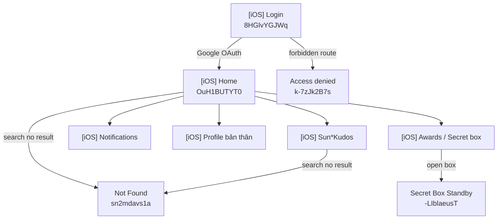

# Screen Flow Overview

## Project Info
- **Project Name**: SAA 2025 (Sun* Awards / Kudos — mobile iOS)
- **Flutter package**: `saa2025` · **Bundle**: `com.sunasterisk.saa2025`
- **MoMorph File Key**: `9ypp4enmFmdK3YAFJLIu6C`
- **MoMorph Base URL**: https://momorph.ai/files/9ypp4enmFmdK3YAFJLIu6C/screens/
- **Figma URL**: https://www.figma.com/design/9ypp4enmFmdK3YAFJLIu6C
- **Created**: 2026-05-19
- **Last Updated**: 2026-05-19
- **Entry screen (user provided)**: [iOS] Login — `8HGlvYGJWq`

> **Note:** `app/spec/spec.txt` mô tả app CAP (SOS Công an). File Figma trên MoMorph là **SAA 2025** (đăng nhập Google, Kudos, Awards). Gen code theo **design MoMorph**, không theo spec CAP trừ khi có file Figma CAP riêng.

---

## Completion (đánh giá sau review — 2026-05-19)

| Metric | % | Ghi chú |
|--------|---|---------|
| **UI mock / luồng màn hình** | **~88%** | Write Kudo submit + profile API wired |
| **Pixel / Figma fidelity** | **~82%** | Profile screen tokens |
| **Release-ready** | **~84%** | TestFlight checklist + API contracts |
| **Sprint P3** | +3% | createtestcases Secret Box + CSV + integration mapping |
| **Sprint P4** | +7% | `.stag.env`, 403 handling, design tokens, STAGING.md |
| **Sprint P5** | +6% | Notifications API + badge + CI + Home/Kudos tokens |
| **Sprint P6** | +6% | POST Kudos + profile/kudos API + TestFlight checklist |

---

## Discovery Progress

| Metric | Count |
|--------|-------|
| Total frames in file | ~170+ |
| **[iOS] app screens** | 35 |
| Discovered (Login) | 1 |
| Remaining iOS flows | 34 |
| **Tracked completion** | **~72%** (không còn dùng mốc ~85%) |

---

## [iOS] Screens — Thứ tự gen code đề xuất

Ưu tiên theo luồng app thực tế. Link format: `https://momorph.ai/files/9ypp4enmFmdK3YAFJLIu6C/screens/{screen_id}`

### Sprint 1 — Core flow (bắt đầu từ Login)

| # | Screen Name | screen_id | MoMorph Link | Status | % | Ghi chú |
|---|-------------|-----------|--------------|--------|---|---------|
| 1 | **[iOS] Login** | `8HGlvYGJWq` | [Login](https://momorph.ai/files/9ypp4enmFmdK3YAFJLIu6C/screens/8HGlvYGJWq) | **implemented** | 90% | Google Sign-In + BE token exchange; `SAA_AUTH_MOCK` |
| 2 | [iOS] Home | `OuH1BUTYT0` | [Home](https://momorph.ai/files/9ypp4enmFmdK3YAFJLIu6C/screens/OuH1BUTYT0) | **implemented** | 80% | Search → Search Sunner; countdown mock |
| 3 | [iOS] Sun*Kudos | `fO0Kt19sZZ` | [Kudos](https://momorph.ai/files/9ypp4enmFmdK3YAFJLIu6C/screens/fO0Kt19sZZ) | **implemented** | 82% | 3 filter chips; `KudosRepository` |
| 4 | [iOS] Sun*Kudos_All Kudos | `j_a2GQWKDJ` | [All Kudos](https://momorph.ai/files/9ypp4enmFmdK3YAFJLIu6C/screens/j_a2GQWKDJ) | **implemented** | 70% | `kudos_all_screen.dart` |
| 5 | [iOS] Notifications | `_b68CBWKl5` | [Notifications](https://momorph.ai/files/9ypp4enmFmdK3YAFJLIu6C/screens/_b68CBWKl5) | **implemented** | 80% | `NotificationsRepository` + badge |
| 6 | [iOS] Profile bản thân | `hSH7L8doXB` | [Profile](https://momorph.ai/files/9ypp4enmFmdK3YAFJLIu6C/screens/hSH7L8doXB) | **implemented** | 85% | `fetchSunnerProfile` + kudos list |
| 7 | [iOS] Profile người khác | `bEpdheM0yU` | [Profile other](https://momorph.ai/files/9ypp4enmFmdK3YAFJLIu6C/screens/bEpdheM0yU) | **implemented** | 85% | Same API by `sunner_id` |

### Sprint 2 — Kudos actions

| # | Screen Name | screen_id | Status | % |
|---|-------------|-----------|--------|---|
| 8 | [iOS] Sun*Kudos_Viết Kudo_default | `7fFAb-K35a` | **implemented** | 88% | `POST /kudos` + preview send |
| 9 | [iOS] Sun*Kudos_Gửi lời chúc Kudos | `PV7jBVZU1N` | **implemented** | 85% | Replaced by `write_kudo_screen.dart` |
| 10 | [iOS] Sun*Kudos_View kudo | `T0TR16k0vH` | **implemented** | 70% |
| 11 | [iOS] Sun*Kudos_View kudo ẩn danh | `5C2BL6GYXL` | **implemented** | 70% |
| 12 | [iOS] Sun*Kudos_Search Sunner | `3jgwke3E8O` | **implemented** | 75% | Home + Kudos entry |
| 13 | [iOS] Sun*Kudos_Searching | `hldqjHoSRH` | **implemented** | 75% | Không có kết quả → Not Found |
| 14 | [iOS] Sun*Kudos_Lỗi chưa điền hết | `0le8xKnFE_` | **implemented** | 80% |
| 15 | [iOS] Sun*Kudos_Tiêu chuẩn cộng đồng | `xms7csmDhD` | **implemented** | 75% |
| — | [iOS] dropdown hashtag | `V5GRjAdJyb` | **implemented** | 80% | `KudosFilterDropdown` + sheet |
| — | [iOS] dropdown phòng ban | `76k69LQPfj` | **implemented** | 80% | Chip Phòng ban trên hub |
| — | [iOS] dropdown hashtag (write) | `aKWA2klsnt` | **implemented** | 80% |
| — | Preview / Images / Rich text | — | **implemented** | 75% |
| 16 | [iOS] Language dropdown | `uUvW6Qm1ve` | **implemented** | 85% |
| 17 | [iOS] Thể lệ | `zIuFaHAid4` | **implemented** | 75% |

### Sprint 3 — Awards & Secret box

| # | Screen Name | screen_id | Status | % |
|---|-------------|-----------|--------|---|
| 18 | [iOS] Open secret box | `kQk65hSYF2` | **implemented** | 75% |
| 19 | [iOS] Open secret box- action bấm mở | `KUmv414uC9` | **implemented** | 70% | `opening` animation |
| — | Standby sau khi đã bấm (7 frames → 1 state) | `-LIblaeusT` … `xptNUunBS_` | **implemented** | 75% | `SecretBoxVisualState.standby` |
| — | Awards hub (tab) | — | **implemented** | 70% |
| 20–25 | Award details (6 giải) | `c-QM3_zjkG` … | **implemented** | 70% |

### Sprint 4 — Errors & edge

| # | Screen Name | screen_id | Status | % |
|---|-------------|-----------|--------|---|
| 27 | [iOS] Access denied | `k-7zJk2B7s` | **implemented** | 90% | PNG + API 403 → screen; 3 TC MoMorph |
| 28 | [iOS] Not Found | `sn2mdavs1a` | **implemented** | 90% | PNG + VN/EN/JA copy |

---

## Routing & errors (Flutter)

| Mechanism | File | Behavior |
|-----------|------|----------|
| Global route guard | `utils/saa_route_guard.dart` | Unknown route → `NotFoundState`; `/admin`, `/protected` → `AccessDeniedState` |
| Search → 404 | `search_sunner.dart` | Query không khớp Sunner (debounce 450ms) → `openNotFound` |
| Home search | `home.dart` | Icon search → `SearchSunnerState` |
| API 403 helper | `SaaApiGuard` + `handleApiAccessDenied()` | `ApiHttpException(403)` → Access Denied |
| Staging config | `.stag.env` + `AppEnvironment` | `SAA_API_MOCK=false`, no mock fallback |
| Google OAuth | `AuthService` + `GoogleAuthService` | Mock: `SAA_AUTH_MOCK=true`; Real: Google → `POST /apis/default/api/login` |
| Session persist | `AuthSessionStore` | `access_token` / `refresh_token` → secure storage |
| Splash gate | `splash.dart` | Valid token → `mainTabState`; invalid → login |
| Content API | `RepositoryProvider` + `SAA_API_MOCK` | Hub, Awards, Notifications, Profile, Submit Kudo |
| Write Kudo | `KudoSubmitMapper` → `POST /kudos` | Preview + Gửi đi → `submitKudo` |
| Unread badge | `NotificationBadgeService` | Home/Kudos/Awards bell dot |

---

## [iOS] Login — Quick spec (from frame overview)

| Thành phần | Mô tả |
|------------|--------|
| Background | Key visual MM_MEDIA |
| Header | Status bar, logo, chọn ngôn ngữ (VN + dropdown) |
| Logo | RootFuther branding |
| Copy | "Bắt đầu hành trình của bạn cùng SAA 2025.\nĐăng nhập để khám phá!" |
| CTA | Button **LOGIN With Google** |
| Footer | "Bản quyền thuộc về Sun* © 2025" |

**Điều hướng dự đoán:** Login thành công → `[iOS] Home` (`OuH1BUTYT0`)

---

## Navigation Graph (iOS MVP)



---

## Known gaps

| Gap | Priority |
|-----|----------|
| `GOOGLE_SERVER_CLIENT_ID` trên staging device | Config |
| BE JSON schema validation E2E trên staging VPN | QA |
| Playwright `e2e/tests/app/` (khi có web build) | Backlog |
| Full CSV export Kudos (39 TC) | Optional |

---

## Không gen trong sprint đầu (design system / web / admin)

- Component libraries: `Button`, `Color`, `Typography`, `Dropdown-*`, …
- Web: `Homepage SAA`, `Login` (web), `Admin-*`
- Duplicate/web Kudos flows không prefix `[iOS]`

---

## E2E & assets (P2)

| Tool | Path | Mô tả |
|------|------|--------|
| Playwright | `e2e/` | Design screen smoke trên MoMorph URLs |
| Integration test | `app/app/integration_test/` | Login + MainTab trên device |
| Asset export | `scripts/export_momorph_assets.sh` | PNG từ Figma node IDs |

## Test cases & E2E (P3)

| Artifact | Path |
|----------|------|
| TC index | `.momorph/contexts/testcases/README.md` |
| Secret Box CSV | `.momorph/contexts/testcases/csv/secret_box_kQk65hSYF2.csv` |
| E2E test plan | `.momorph/contexts/e2e/test_plan_core_flows.md` |
| Playwright design | `e2e/tests/design/` (5 passed) |
| Flutter IT | `app/app/integration_test/` (4 tests) |

**MoMorph upload (P3):** 5 TC Secret Box `kQk65hSYF2`  
**MoMorph upload (P4):** 3 TC Access denied `k-7zJk2B7s`  
**MoMorph upload (P5):** 3 TC Notifications `_b68CBWKl5`  
**MoMorph upload (P6):** Write Kudo `7fFAb-K35a` (2 TC), Profile `hSH7L8doXB` (1 TC)

## TestFlight (P6)

| Artifact | Path |
|----------|------|
| Checklist | `.momorph/contexts/TESTFLIGHT.md` |

## CI (P5)

| Job | Path |
|-----|------|
| Flutter analyze + test | `.github/workflows/ci.yml` |
| Playwright design | `e2e/tests/design/` (7 specs) |

## Staging (P4)

| Artifact | Path |
|----------|------|
| Hướng dẫn | `.momorph/contexts/STAGING.md` |
| Env staging | `app/packages/https/.stag.env` |
| Smoke script | `scripts/staging_smoke.sh` |
| Design tokens | `app/app/lib/theme/saa_design_tokens.dart` |

## Next commands

```text
flutter run --dart-define=ENV=stag
./scripts/staging_smoke.sh
cd e2e && npm test
cd app/app && flutter test integration_test/
```
